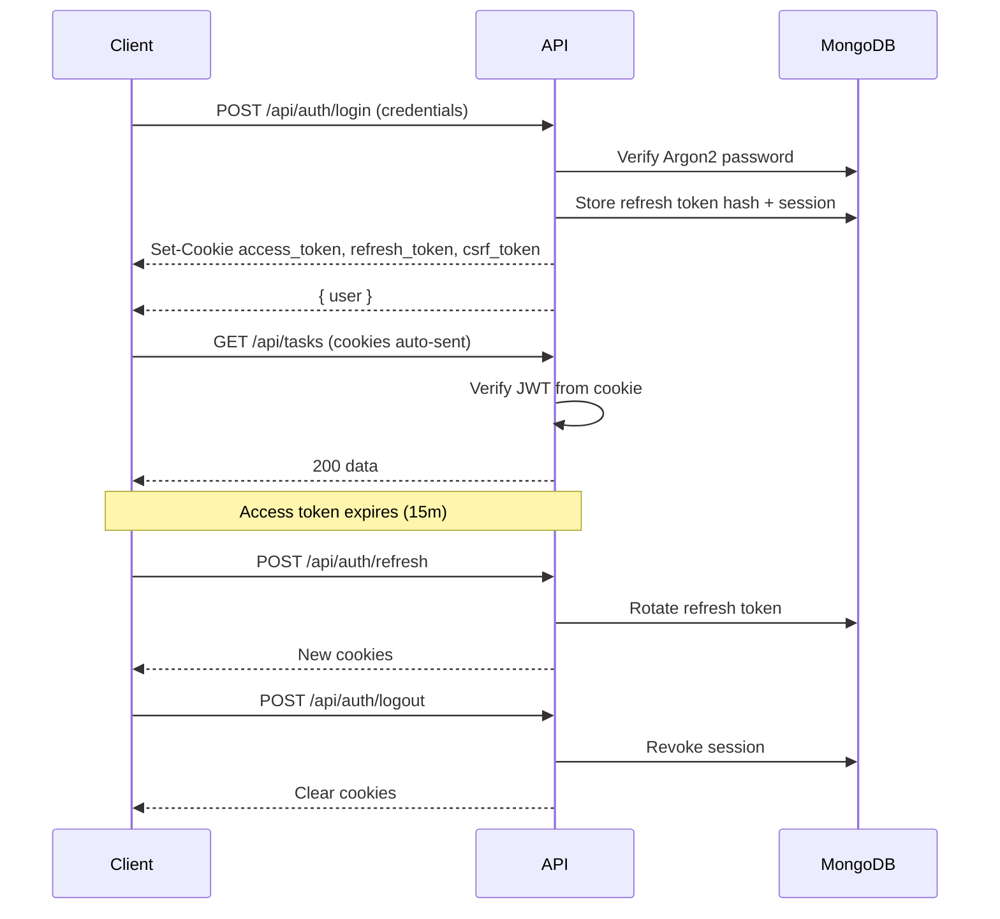
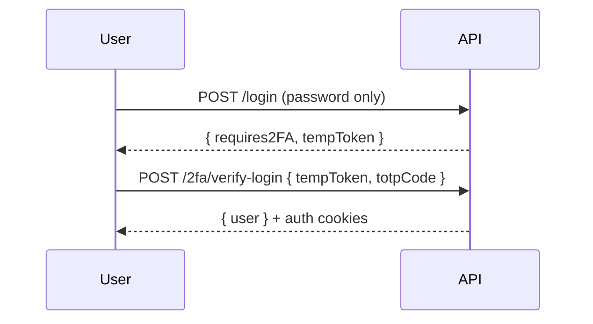

# Authentication Flow

## Overview

The platform uses **JWT access tokens** (15 minutes) and **opaque refresh tokens** (30 days) with **refresh token rotation**. Tokens are stored in **HttpOnly Secure cookies**; refresh token hashes are persisted in MongoDB.

## Two-factor authentication (TOTP)

## Password reset

1. `POST /api/auth/forgot-password` — sends one-time link (1 hour).
2. User opens link with `?resetToken=...`
3. `POST /api/auth/reset-password` — validates token, Argon2 hash, revokes all sessions.

OTP reset remains available via `email` + `otp` on the same reset endpoint.

## CSRF

State-changing requests require header `X-CSRF-Token` matching the `csrf_token` cookie (double-submit pattern).

## Roles

| accountRole | Description |
|-------------|-------------|
| superadmin | Platform operator |
| admin | Tenant workspace owner |
| teamlead | Team leadership |
| projectmanager | PM access |
| user | Team member |
| viewer | Read-only |

Use `requireRole()` and `requireMinimumRole()` middleware for route protection.
